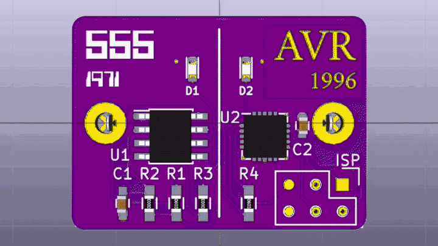
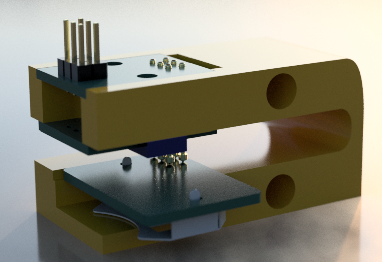

# Eras of Blinking

Blinking an LED as it was done in the 1970s (555) and the 1990s (AVR).

I am using this project to learn KiCAD and SMT fabrication.  Also
learning to use pogo pins to flash a microcontroller.

# The ISP Pogo Jig

I designed and built a jig to hold pogo pins against the board's ISP
headers to program the AVR.  In the end, I did not use the jig; it did not
press the pogo pins against the contacts hard enough to make a solid
connection.

I found Nick Sayers'
[AVR ISP Pogo Adapter v0.5](https://oshpark.com/shared_projects/iyo8KOe5)
on OSH Park and ordered it.  I soldered the pogo pins to two boards 7
mm apart so the pins would be well aligned.

I use [ecad.io](https://ecad.io) to create STEP files representing the
boards' geometric shapes.  I imported the boards into Fusion 360,
modeled a pogo pin, and designed a jig around them.

The [Fusion 360 model is here](http://a360.co/2aq1vVH).  

If I did it again, I would do it very differently.  I think I would
flip the jig over so the board sits on top, with some kind of latch to
hold it in place.

# Differences between v1.0 and v1.1

  - Shrink through holes for battery clip.
  - Eliminate rectangle around "AVR" lettering.
  - Change "555" and "1971" lettering to get better separation.
  - Enlarge "CR2032" lettering.
  - Enlarge presidents' caricatures, just keep the faces.
  - Increment the silkscreen version number.

# Resources

[Getting to Blinky 4.0](https://www.youtube.com/playlist?list=PLy2022BX6Eso532xqrUxDT1u2p4VVsg-q)
Video tutorials for KiCAD 4.0

[Flashing LED Circuit](http://www.555-timer-circuits.com/flashing-led.html)
Simple 555 astable circuit.  Cribbed mercilessly.

[How to Build an AVR Blinking LED Circuit](http://www.learningaboutelectronics.com/Articles/AVR-blinking-LED-circuit.php)

[Programming an ATtiny w/ Arduino 1.6](http://highlowtech.org/?p=1695)

[LED Resistor Calculator](http://led.linear1.org/1led.wiz)

[3D KiCAD Parts tutorial](http://happyrobotlabs.com/posts/tutorials/tutorial-3d-kicad-parts-using-openscad-and-wings3d/)

[KiCAD graphics tutorial](http://blog.komar.be/making-pcb-artwork-in-kicad/)
